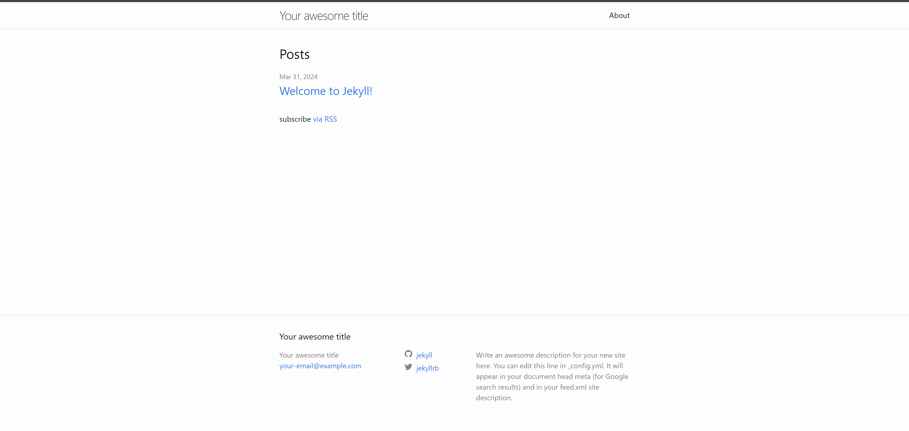

我看到有很多人都创建了自己的Blog，后缀都是github.io。

查了一下发现，Github可以免费托管个人博客了，那不赶紧搞起来。

## 创建一个空的项目，命名必须是你的Github名称 + github.io

举个例子，你的名字叫`WTF`，那你的项目名称就是`WTF.github.io`


## 创建你的博客

### 进入Codespace

进入项目中，你会看到那个绿色的`code`，点他你会进入Codespace，这意味着你不需要在自己的电脑上配置任何环境。顺便一提Codespace这个东西真的强的一批，居然还带了VS Code编辑器。


### 安装Jekyll

进入到Codespace之后，你的界面是这样的，在终端里面输入下面的代码


```bash
gem install jekyll bundler

jekyll new ./

bundle install
bundle exec jekyll serve
```

### 恭喜你彦祖，你的Blog已经打开了

网页上会提醒你，你运行了4000端口，选择打开，之后你就会看到



### 安装主题

可以在[rubygems](https://rubygems.org/search?query=jekyll-theme)中搜索主题，我选了[primer](https://github.com/pages-themes/primer)

```yaml
# Build settings
# theme: minima
theme: jekyll-theme-[primer](https://github.com/pages-themes/primer)
plugins:
  - jekyll-feed
```

```bash
gem "jekyll", "~> 4.3.3"
# This is the default theme for new Jekyll sites. You may change this to anything you like.
gem "minima", "~> 2.5"
gem "jekyll-theme-[primer](https://github.com/pages-themes/primer)"
```

```bash
bundle install
bundle exec jekyll serve
```

有两个Warning
