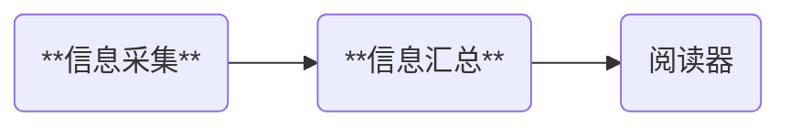

## 背景介绍

RSS代表"Really Simple Syndication"（真正简单联播），它是一种用于在网络上发布经常更新的内容的标准格式。

用户可以使用RSS阅读器或支持RSS的应用程序来订阅这些内容，以便**在一个统一的界面中浏览和管理多个来源的更新**。

可以这么说，整个互联网是一个大的数据库，但是他们并不互通，变为了孤岛，而RSS只用回归他的初衷“聚合信息”，就足以将你从信息茧房和爆炸的信息流中解放出来。

## 工具介绍

上面两个图分别是思路和工具的对照

[RSSHub](https://docs.rsshub.app/zh/guide/)：作用是**信息采集**，RSS虽然出现时间比较早，但是目前很多网页其实不支持RSS，甚至有严格的反爬虫策略，RSSHub的作用就是绕过这些限制，对信息采集起来。

[TTRSS](http://ttrss.henry.wang/zh/)：作用是**信息汇总**，如果你有多个设备，你就需要记录你阅读过信息了，这时你就会用到TTRSS。
