> [**🚀 Getting Started | Open WebUI**](https://docs.openwebui.com/getting-started/)\
> How to Install 🚀\
> <https://docs.openwebui.com/getting-started/>

> [ **Llama 3.1**](https://llama.meta.com/)\
> The open source AI model you can fine-tune, distill and deploy anywhere. Our latest models are available in 8B, 70B, and 405B variants.\
> <https://llama.meta.com/>

> [ **Docker Compose 快速部署**](https://doc.fastgpt.in/docs/development/docker/)\
> 使用 Docker Compose 快速部署 FastGPT\
> <https://doc.fastgpt.in/docs/development/docker/>

> [ **Document loaders | 🦜️🔗 LangChain**](https://python.langchain.com/v0.1/docs/modules/data_connection/document_loaders/)\
> Head to Integrations for documentation on built-in document loader integrations with 3rd-party tools.\
> <https://python.langchain.com/v0.1/docs/modules/data_connection/document_loaders/>

> [ **Notebooks - Unstructured**](https://docs.unstructured.io/examplecode/notebooks)\
> Notebooks contain complete working sample code for end to end solutions.\
> <https://docs.unstructured.io/examplecode/notebooks>

# 项目的结构

```mermaid
graph LR
    A[检索] --> B[下载PDF]
    B --> C[读取PDF内容]
    C --> D[embedding存入]
    D --> E[LLM汇总相关信息]

```

*   检索

    检索部分考虑到使用Google API的价格，所以还是本地Selenium

*   下载PDF

    *   通过巨潮信息的接口下载

    *   或者通过网页信息聚合下载

*   读取PDF

    *   PDF是文字的：使用unstructured批量处理，返回文字

    *   PDF是纯粹图片的：使用PaddleOCR进行读取，因为PaddleOCR在Windows上安装环境问题很多，包括在Docker镜像的GPU调用上也存在很多问题，但是多次调试没弄好，暂时就用CPU吧

        [Docker Hub | Paddle/PaddleOCR](https://hub.docker.com/r/paddlecloud/paddleocr/tags?page=\&page_size=\&ordering=\&name=)

        ***

        最终GPU解决方案：[PaddleOCR的安装](https://www.notion.so/2b389a93748a4ecca4ab79bb59825db7)

*   embedding存入

    目前使用官网教程，FAISS

    > [**Installing cuDNN on Linux — NVIDIA cuDNN v9.3.0 documentation**](https://docs.nvidia.com/deeplearning/cudnn/latest/installation/linux.html)\
    > <https://docs.nvidia.com/deeplearning/cudnn/latest/installation/linux.html>
